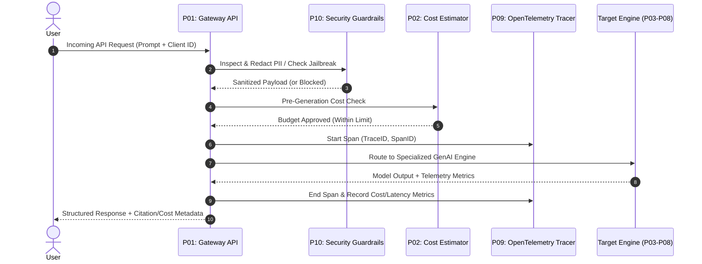

# Technical Architecture & System Specifications

## Overview
This document details the architectural design patterns, component data flows, SLA budgets, and security parameters across all 12 GenAI projects.

## Component Interconnection & Data Flow

## Production Latency Budget Table

| Component | Target P95 Latency | Memory Footprint | Failover / Circuit Breaker |
| :--- | :--- | :--- | :--- |
| **API Wrapper (P01)** | `< 15ms` | ~45MB | Primary to Secondary LLM Fallback |
| **Token Estimator (P02)** | `< 2ms` | ~12MB | Fallback heuristic count |
| **JSON Agent (P03)** | `< 85ms` | ~60MB | Max 3 retries with error feedback |
| **Cited RAG (P04)** | `< 120ms` | ~180MB | BM25 keyword fallback |
| **HITL Workflow (P05)** | `< 10ms (submission)` | ~35MB | Requires human sign-off on high risk |
| **Streaming SSE (P06)** | `< 45ms (TTFT)` | ~50MB | Optimistic UI status banner |
| **Eval Harness (P07)** | `< 2.5s (50 cases)` | ~110MB | Automated regression alert |
| **Local vLLM (P08)** | `< 25ms (AWQ INT4)` | ~38GB VRAM | Dynamic PagedAttention KV Cache |
| **Traced OTel (P09)** | `< 1ms` | ~25MB | Prometheus metrics buffer |
| **Security Guard (P10)** | `< 8ms` | ~40MB | Block request on violation |

## Security & PII Redaction Rules
- **Regex Patterns**: SSN (`\d{3}-\d{2}-\d{4}`), Credit Cards, Email, Phone, API Keys (`sk-***`).
- **Jailbreak Rules**: Regex detection of `ignore previous instructions`, `DAN mode`, `sudo override`, base64 obfuscation.
